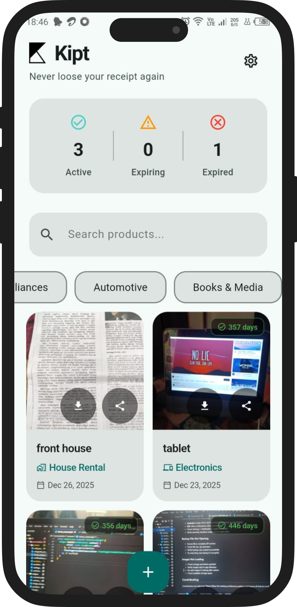
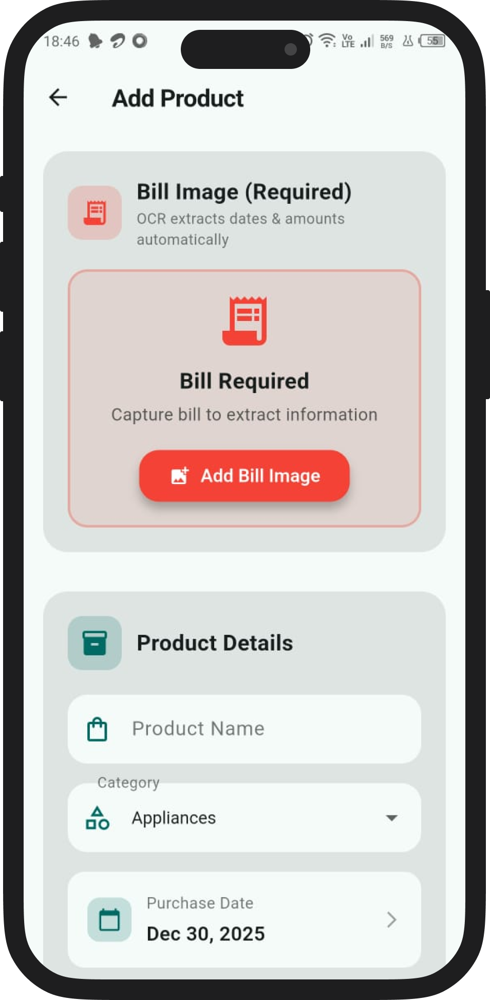
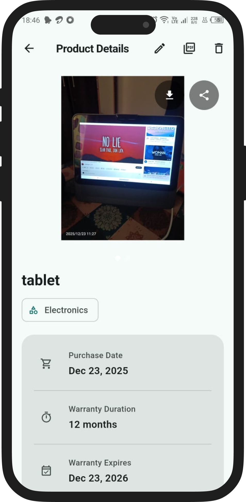
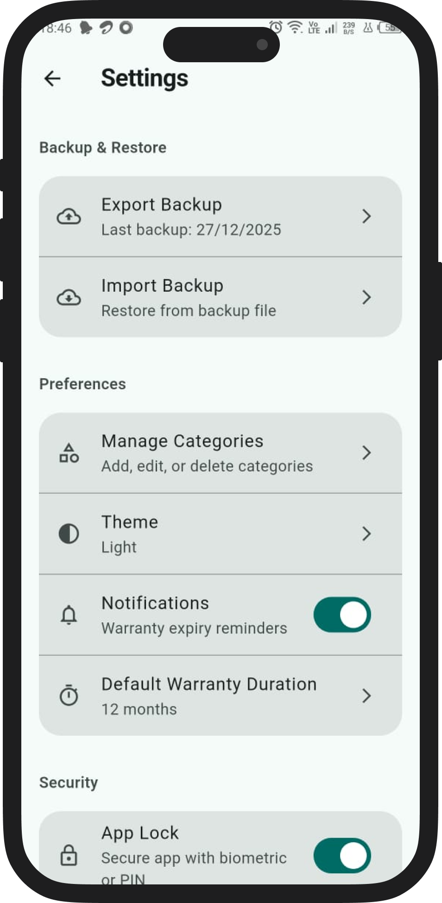
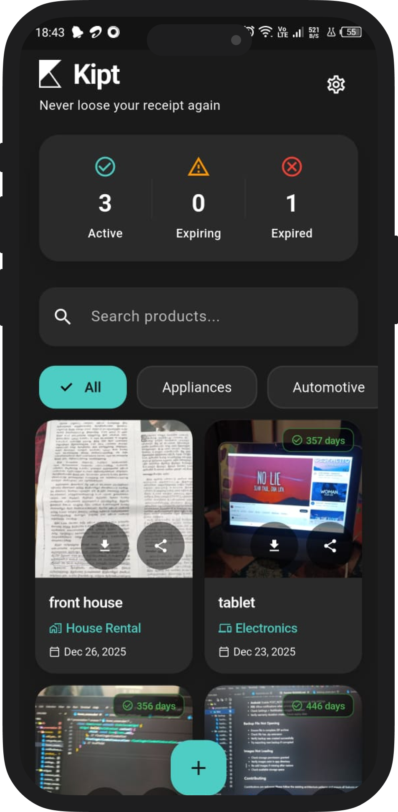
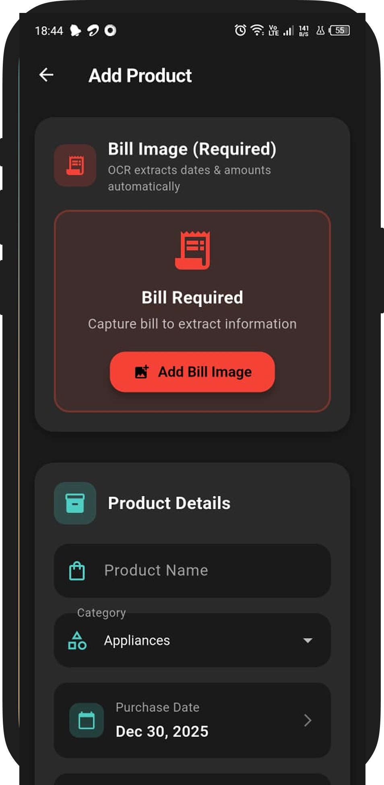
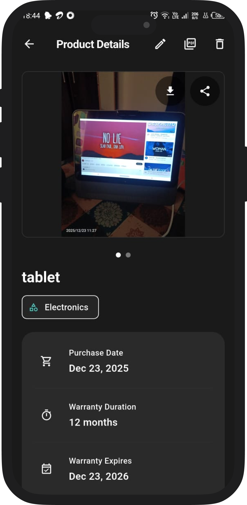
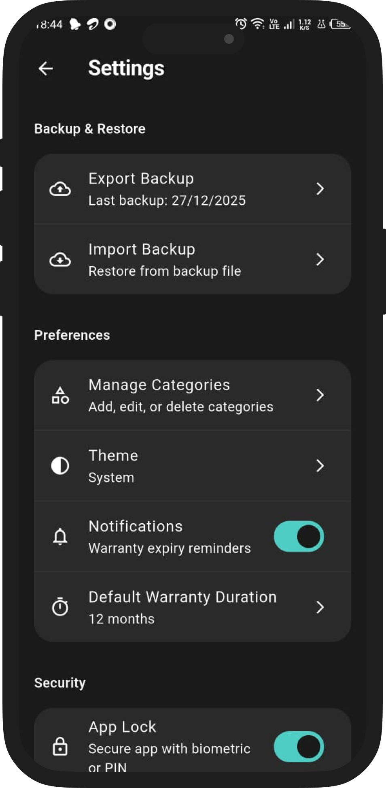

# Kipt - Smart Warranty & Asset Manager

<div align="center">


<br/>


**Your personal offline-first vault for managing product warranties, bills, receipts, and rental assets.**

</div>

---

##  App Overview

**Kipt** is a comprehensive mobile application designed to help users organize and track their valuable assets. Whether it is keeping track of warranty expirations, storing digital copies of bills, or managing rental equipment returns, Kipt handles it all with a secure, offline-first approach.

With a beautiful, adaptive UI that supports both Light and Dark themes, Kipt ensures your data is always accessible and presented professionally.

##  Key Features

- ** Warranty Tracking**: Automatically calculate and track warranty expiry dates based on purchase date and warranty period.
- ** Digital Bill Storage**: Capture and store high-quality images of your bills and receipts. Never lose a paper bill again.
- ** Smart Notifications**: Get timely reminders before your warranties or rental periods expire.
- ** Biometric Security**: Secure your sensitive data with App Lock (Fingerprint/Face ID) support.
- ** Backup & Restore**: Full data portability with encrypted ZIP backups containing your database and images.
- ** PDF Reports**: Generate professional PDF reports for your products, complete with bill images and details.
- ** Adaptive Theming**: Beautifully designed Light and Dark modes to suit your preference.
- ** Categorization**: Organize items into custom categories (Electronics, Furniture, etc.) for easy retrieval.
- ** Advanced Search**: Quickly find any item by name, category, or brand.
- ** Rental Management**: Dedicated fields for tracking rental items, including return dates and rental contacts.

---

##  App Screenshots

### Light Theme
| Home Screen | Add Product | Product Details | Settings |
|:---:|:---:|:---:|:---:|
|  |  |  |  |

### Dark Theme
| Home Screen | Add Product | Product Details | Settings |
|:---:|:---:|:---:|:---:|
|  |  |  |  |

---

##  Technical Architecture

This project is built using **Flutter** and follows a clean, maintainable architecture.

###  Tech Stack
- **Language**: Dart
- **Framework**: Flutter
- **State Management**: BLoC (Business Logic Component) & Cubit
- **Database**: Hive (NoSQL)
- **Local Storage**: Shared Preferences
- **Notifications**: Flutter Local Notifications
- **PDF Generation**: `pdf` & `printing` packages
- **Image Handling**: `image_picker`, `image_gallery_saver_plus`
- **Security**: `local_auth` (Biometrics)

###  Project Structure
```
lib/
 core/                   # Core utilities, constants, and theme config
    constants/          # App-wide constants (DB names, table names)
    theme/              # AppTheme definitions (Light/Dark)
    utils/              # Helpers for Dates, Images, and Parsing
 data/                   # Data layer
    database/           # Hive database helper and adapters
    models/             # Data models (Product, Note, Category)
    repositories/       # Services for Auth, Backup, PDF, Notifications
 presentation/           # UI layer
    bloc/               # BLoC state management classes
    screens/            # Application screens (Home, Add, Details)
    widgets/            # Reusable UI components
 main.dart               # App entry point and dependency injection
```

---

##  Getting Started

Follow these steps to set up the project on your local machine.

### Prerequisites
- [Flutter SDK](https://flutter.dev/docs/get-started/install) (v3.10.0 or higher)
- Dart SDK
- Android Studio / VS Code
- Android Emulator or Physical Device

### Installation

1. **Clone the repository**
   ```bash
   git clone https://github.com/yourusername/kipt-warranty-vault.git
   cd bill
   ```

2. **Install dependencies**
   ```bash
   flutter pub get
   ```

3. **Run the app**
   ```bash
   flutter run
   ```

### Building for Release

To build an APK for Android:
```bash
flutter build apk --release
```

---

##  Usage Guide

1. **Adding an Item**: Tap the `+` button on the home screen. Enter product details, attach a bill image, and save.
2. **Setting Reminders**: The app automatically schedules notifications based on the expiry date. You can customize this in Settings.
3. **Generating Reports**: Open a product, tap the PDF icon to generate and share a detailed report.
4. **Backup Data**: Go to Settings > Backup & Restore to create a secure backup of your data.

---

##  Contributing

Contributions are welcome! Please feel free to submit a Pull Request.

1. Fork the project
2. Create your feature branch (`git checkout -b feature/AmazingFeature`)
3. Commit your changes (`git commit -m "Add some AmazingFeature"`)
4. Push to the branch (`git push origin feature/AmazingFeature`)
5. Open a Pull Request

---

##  License

This project is licensed under the MIT License - see the [LICENSE](LICENSE) file for details.

---
<div align="center">
  <p>Made with  using Flutter</p>
</div>
